# 概述

#### 图像处理三个层次？

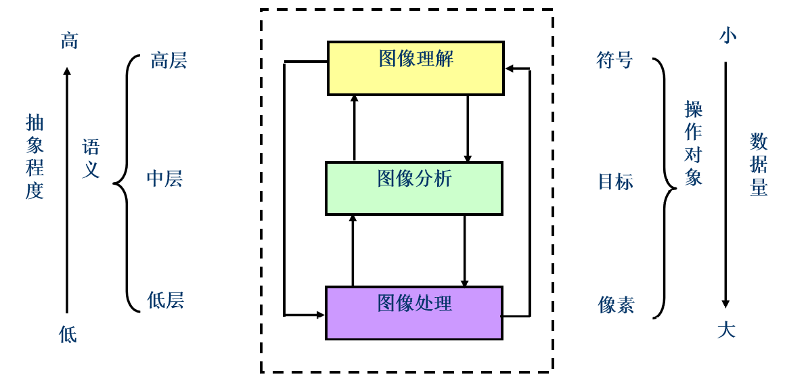

#### 图像的采样和量化？

- **采样**：空间坐标 $(x,y)$ 的数字化
- **量化**：图像幅值 $f$ 的离散化

#### 图像描述方式？

- **RGB**：从物理和光学角度描述颜色不同

- **HSI**（H---hue 色度，S---saturation 饱和度，I---intensity 强度）：根据视觉的主观感受对颜色进行描述

  H 表示颜色种类

  S 表示颜色深浅浓淡程度

  I 表示整体亮度
  
- **CMYK**

- **YUV**

#### 图像处理的目的？

- 提高图像的视感质量
- 提取图像包含的某些特征或特殊信息， 便于分析
- 对图像数据进行变换、 编码、压缩， 便于图像的存储和传输

#### 图像统计特性？

单幅图像的统计特性

- **信息量**：如果一幅图像共有 $k$ 种灰度值，出现的概率分别为 $p_1, p_2, p_3, ... , p_k$，根据香农定理，信息量为

$$
H=-\sum_{i=1}^k p_i log p_i
$$

- **灰度均值**：所有像素灰度值的算术平均值

$$
\bar{f}=\frac{\sum_{i=0}^{M-1}\sum_{j=0}^{N-1} f(i,j)}{MN}
$$

- **灰度众数**：出现次数最多的灰度值

- **灰度中值**：全部灰度值中处于中间的值

- **灰度方差**：反映各像素灰度值与图像灰度均值的离散程度

$$
S=\frac{\sum_{i=0}^{M-1}\sum_{j=0}^{N-1}[f(i, j)-\bar{f}]^2}{MN}
$$

- **灰度值域**：图像最大灰度值和最小灰度值之差

$$
f_{range}(i,j)=f_{max}(i,j)-f_{min}(i,j)
$$

多幅图像间的统计特性

- **协方差**：设 $f(i,j)$ 和 $g(i,j)$ 表示大小为 $M×N$ 的两幅图像，则两者之间的协方差为

$$
S_{gf}^2=S_{fg}^2=\frac{1}{MN}\sum_{i=0}^{M-1}\sum_{j=0}^{N-1}[f(i,j)-\bar{f}][g(i,j)-\bar{g}]
$$

- **相关系数**：反映两个不同波段图像所含信息的重叠程度

$$
r_{fg}=\frac{S_{fg}^2}{S_{ff}\cdot S_{gg}}
$$

#### 齐次坐标？

用 $N+1$ 个数来表示 $N$ 维坐标的一种方式

齐次坐标和笛卡尔坐标的转换关系
$$
(x,y,w) = (\frac{x}{w},\frac{y}{w})
$$
使用原因：使图形和几何学的计算在投影空间中成为可能

#### 相机标定？

为确定物体某点的空间位置与其在图像中对应点的相互关系，必须建立相机成像的几何模型，几何模型的参数（又称为相机参数，包括内参、外参、畸变参数）需要通过实验计算得到，该过程叫相机标定

#### 相机标定流程？

1. 打印一张棋盘格，把它贴在一个平面上，作为标定物
2. 通过调整标定物或摄像机的方向，为标定物拍摄一些不同方向的照片
3. 从照片中提取棋盘格角点
4. 估算理想无畸变的情况下，五个内参和六个外参
5. 应用最小二乘法估算实际存在径向畸变下的畸变系数
6. 极大似然法，优化估计，提升估计精度

#### 相机标定方法对比？

|  标定方法  |              优点              |         缺点         |           常用方法           |
| :--------: | :----------------------------: | :------------------: | :--------------------------: |
|   传统法   |  适用于任意相机模型、 精度高   | 需要标定物、算法复杂 |    Tsai两步法、张氏标定法    |
| 主动视觉法 | 无需标定物、算法简单、鲁棒性高 |   成本高、设备昂贵   |  主动系统控制相机做特定运动  |
|  自标定法  |      灵活性强、可在线标定      |   精度低、鲁棒性差   | 分层逐步标定、基于Kruppa方程 |

# 图像增强

#### 图像增强是什么？

按需要突出图像中的有用信息，削弱“无用”信息

#### 图像增强目的？

- 改善图像的视觉效果
- 突出图像的特征，便于计算机处理

#### 图像基本运算？

**灰度变换**：$B(x,y)=f(A(x,y))$，像素灰度值的逐点运算（与相邻像素无关），可以改善图像显示效果，主要有

- 线性变换
- 对数变换
- 幂律（伽马）变换
- 分段线性变换
- 灰度插值

**代数运算**：两幅图像进行点对点的加、减、乘、除运算得到输出图像的过程，主要有

- $C(x,y) = A(x,y)+ B(x,y)$：去除“叠加性”随机噪音；生成图像叠加效果
- $C(x,y) = A(x,y) - B(x,y)$：消除背景影响
- $C(x,y) = A(x,y) \times B(x,y)$：图像的局部显示
- $C(x,y) = A(x,y) \div B(x,y)$：常用于遥感图像处理

**坐标变换**：也称为仿射变换，包括平移、旋转、缩放等
$$
f' = \left[ {\begin{array}{*{20}{c}}
  {x'} \\ 
  {y'} \\ 
  1 
\end{array}} \right] = A \cdot f = \left[ {\begin{array}{*{20}{c}}
  {{a_{11}}}&{{a_{12}}}&{{a_{13}}} \\ 
  {{a_{21}}}&{{a_{22}}}&{{a_{23}}} \\ 
  {{a_{31}}}&{{a_{32}}}&{{a_{33}}} 
\end{array}} \right]\left[ {\begin{array}{*{20}{c}}
  x \\ 
  y \\ 
  1 
\end{array}} \right]
$$

- 平移：

$$
A = \left[ {\begin{array}{*{20}{c}}
  1&0&{\Delta x} \\ 
  0&1&{\Delta y} \\ 
  0&0&1 
\end{array}} \right]\;\;\;\;\;\;\;\;\;{A^{ - 1}} = \left[ {\begin{array}{*{20}{c}}
  1&0&{ - \Delta x} \\ 
  0&1&{ - \Delta y} \\ 
  0&0&1 
\end{array}} \right]\;\;
$$

- 缩放：

$$
A = \left[ {\begin{array}{*{20}{c}}
  {{S_x}}&0&0 \\ 
  0&{{S_y}}&0 \\ 
  0&0&1 
\end{array}} \right]\;\;\;\;\;\;\;\;\;{A^{ - 1}} = \left[ {\begin{array}{*{20}{c}}
  {1/{S_x}}&0&0 \\ 
  0&{1/{S_y}}&0 \\ 
  0&0&1 
\end{array}} \right]\;\;
$$

- 旋转：

$$
A = \left[ {\begin{array}{*{20}{c}}
  {\cos \theta }&{\sin \theta }&0 \\ 
  { - \sin \theta }&{\cos \theta }&0 \\ 
  0&0&1 
\end{array}} \right]\;\;\;\;\;\;\;\;\;{A^{ - 1}} = \left[ {\begin{array}{*{20}{c}}
  {\cos \theta }&{ - \sin \theta }&0 \\ 
  {\sin \theta }&{\cos \theta }&0 \\ 
  0&0&1 
\end{array}} \right]
$$

#### 图像的膨胀与腐蚀运算？

膨胀：对图像高亮区域进行扩张，本质是求局部最大值

腐蚀：对图像高亮区域进行缩减，本质是求局部最小值

#### 图像的开闭运算？

开运算：先腐蚀再膨胀，用于消除小物体

闭运算：先膨胀再腐蚀，用于排除小型黑洞

#### 图像的礼帽与黑帽运算？

礼帽：原图像与开运算之差，用于分离比邻近点亮一些的斑块

黑帽：闭运算与原图像之差，用于分离比邻近点暗一些的斑块

#### 霍夫（Hough）变换？

把图像空间的特定形状（直线、圆等）转换成参数空间（霍夫空间）的点，可用于检测图像中的直线和圆等

#### 霍夫变换性质？

|             图像空间              |    霍夫空间    |
| :-------------------------------: | :------------: |
|         直线 $y = ax + b$         |  点 $(a, b)$   |
| 圆 $ (x - a)^2 + (y - b)^2 = r^2$ | 点 $(a, b, r)$ |

#### 如果图像光照变化大，怎么处理？

- 使用直方图均衡化，对比度拉伸调节

- 如果图像色彩整体往一方向移动（发黄、发蓝、发红），用白平衡算法进行修正，使趋近于自然光下的图像

- 如果图像过亮或过暗，可以设置局部阈值函数，对特定区域进行阈值分割，图像太暗还可采用对数灰度变换

- 使用拉普拉斯算子增强

#### 图像增强包含哪些内容？

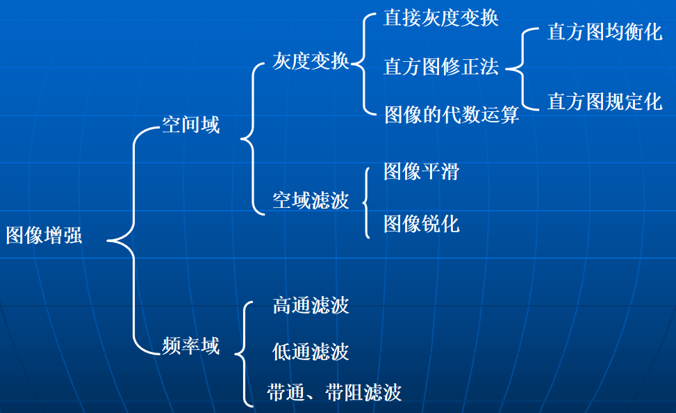

#### 空间域的直接灰度变换包含哪些内容？

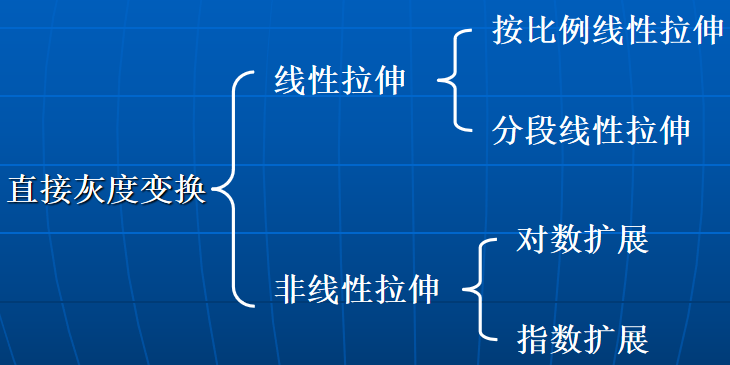

- 优点：快，简单

- 缺点：效果有限

#### 直方图修正包含哪些内容？

- 直方图均衡化
- 直方图规定化

#### 直方图均衡化的目的？步骤？

- 目的：将原始图像的直方图变为均衡分布的形式，用于提高对比度

- 步骤：

1. 统计图像各灰度级的像素数目
2. 计算图像直方图
3. 用变换函数计算映射后输出的灰度级
4. 统计新的灰度级的像素数目
5. 计算输出图像的直方图

#### 直方图规定化的目的？步骤？

目的：修改一幅图像的直方图，使它与另一幅图像的直方图匹配或具有一种预先规定的函数形状

步骤：以均衡化的直方图为“桥”

#### 滤波目的？

- 消除图像的噪声
- 提取图像的特征

#### 如何理解滤波器？

滤波器可以看成一个包含加权系数的窗口，当使用滤波器去处理图像时，就是把这个窗口和图像进行运算

#### 空间域滤波是什么？

一种基于**邻域处理**的增强方法，应用模板对像素与其邻域的像素进行某种数学运算得到新的像素值

#### 空间域滤波包含哪些内容？

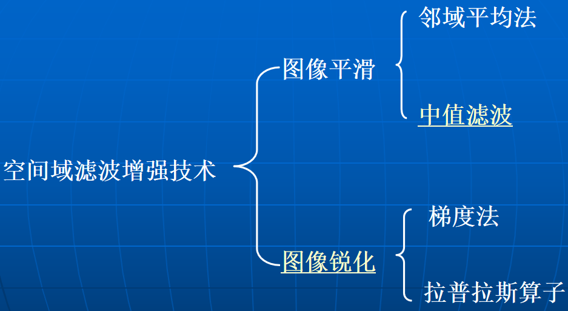

#### 图像平滑包含哪些内容？

- 均值滤波
- 中值滤波
- 高斯滤波

#### 均值滤波是什么？特点？

用几个像素灰度的平均来代替一个像素原来的灰度值，实现图像的平滑

方式：

- 简单平均法
- 加权平均

缺点：会导致边缘模糊，细节丢失

#### 中值滤波是什么？特点？

用一个窗内的中值代表该区域的值

优点：

- 非线性
- 适合抑制图像的随机脉冲噪声（椒盐噪声）

#### 高斯滤波是什么？步骤？

一种根据高斯函数形状来选择权值的线性平滑滤波器，适用于消除高斯噪声

步骤：

- 移动高斯核模板，使中心元素位于输入图像待处理像素的正上方
- 将输入图像的像素值作为权重，乘以高斯核
- 将结果相加作为输出（卷积）

#### 二维高斯滤波能否分解成一维操作？

可以分解

二维高斯滤波分解为两次一维高斯滤波，高斯二维公式可以推导为X轴与Y轴上的一维高斯公式，即使用一维高斯核先对图像逐行滤波，再对中间结果逐列滤波

#### 什么是图像的卷积？

图像滑窗与模板的对应点乘求和

#### 图像锐化包含哪些内容（边缘检测算子）？

**一阶微分算子（梯度算子）**

- **Roberts 算子（交叉差分算子）**：对具有陡峭的低噪声图像处理效果较好，但是边缘定位不够准确，对噪声敏感
- **Prewitt 算子**：对噪声有抑制作用，但边缘定位准确度不如 Roberts 算子
- **Sobel 算子**：赋予较近的相邻像素更大的权值，对灰度渐变和噪声较多的图像处理效果较好
- **Isotropic Sobel 算子**（各向同性 Sobel 算子）：位置加权系数更为准确，在检测不同方向的边缘时梯度的幅度一致（各向同性）

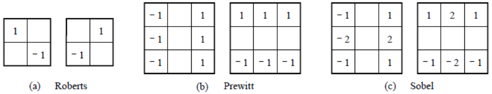

**二阶微分算子**

- **拉普拉斯算子**：要求模板对应中心像素的系数为正，邻域像素的系数为负，所有系数的总和为零

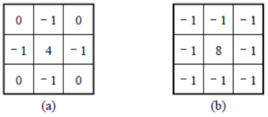

- **Marr 算子（高斯拉普拉斯算子**），计算步骤如下

1. 用一个高斯平滑模板与原图像卷积，平滑图像
2. 计算卷积后图像的拉普拉斯值
3. 检测拉普拉斯图像中的过零点作为边缘点

- **Canny 算子**：使用两种不同的阈值分别检测强边缘和弱边缘，仅当弱边缘和强边缘相连时，才将边缘包含在输出图像中，因此不易受噪声的干扰，能够检测出真正的弱边缘，计算步骤如下：

1. 用一个高斯平滑模板与原图像卷积，平滑图像
2. 用一阶偏导有限差分计算梯度的幅值和方向
3. 对梯度幅值进行非极大值抑制
4. 用双阈值算法检测和连接边缘

#### 图像梯度特点？

- 轮廓上，灰度有陡然变化，梯度值很大
- 非轮廓上，灰度变化平缓，梯度值很小
- 等灰度区域上，梯度值为零

#### 图像中的低频信息和高频信息？

- 低频信息（低频分量）：灰度值变化缓慢的区域，对应着图像中大块平坦的区域
- 高频信息（高频分量）：灰度值变化剧烈的区域，对应着图像的边缘、轮廓、噪声以及细节部分

#### 频域与空间域关系？

图像频率是衡量灰度变化剧烈程度的指标

- 图像变化平缓的部分靠近频率平面的圆心，这个区域为低频区域
- 图像中的边、噪音、变化陡峻的部分，远离圆心，这个区域为高频区域

#### 图像的频域滤波包含哪些内容？

- 低通滤波
- 高通滤波
- 带通、带阻滤波

#### 低通滤波器的思想？有哪些？

主要思想：滤掉高频部分，保留低频部分，在频域中实现平滑处理
$$
G(u,v)=H(u,v)F(u,v)
$$

其中 $H(u,v)$ 称为转移函数，根据转移函数的不同，分为

- **理想低通滤波器**

$$
H(u,v)=\begin{cases}1\quad D(u,v)\le D_0\\
0\quad D(u,v)>D_0 \end{cases} \quad\quad\quad\quad D(u,v)=(u^2+v^2)^{1/2}
$$

​	特点：

1. 物理上不可实现
2. 有明显跳跃（振铃）现象
3. 会使图像变模糊

- **巴特沃斯低通滤波器**

$$
H(u,v)=\frac{1}{1+\sqrt{2}-1[D(u,v)/D_0]^{2n}}
$$

​	特点：

1. 没有明显的跳跃现象
2. 模糊程度减少
3. 尾部含有较多的高频，对噪声的平滑效果不如理想低通滤波器

- **指数形低通滤波器**

$$
H(u,v)=exp(ln(1/\sqrt{2})[D(u.v)/D_0]^n)
$$

​	特点：

1. 更加平滑的过滤带，没有跳跃现象
2. 相比巴特沃斯低通滤波器，衰减更快，所以图像更模糊一些

- **梯形低通滤波器**

$$
H(u,v)=\begin{cases} 1\quad D(u,v)\le D_0 \\ [D(u,v)-D_1]/(D_0-D_1)\quad D_0<D(u,v)\le D_1 \\
0\quad D(u,v)>D_1 \end{cases}
$$

- **高斯低通滤波器**

#### 低通滤波器比较？

|        类别        | 振铃程度 | 图像模糊程度 | 噪声平滑效果 |
| :----------------: | :------: | :----------: | :----------: |
|   理想低通滤波器   |   严重   |     严重     |     最好     |
| 巴特沃斯低通滤波器 |   较轻   |      轻      |      好      |
|  指数形低通滤波器  |    无    |     较轻     |     一般     |
|   梯形低通滤波器   |    无    |     很轻     |     一般     |

振铃程度：指输出图像的灰度剧烈变化处产生的震荡，就好像钟被敲击后产生的空气震荡

#### 高通滤波是什么？有哪些？

其实就是低通滤波的反转，常用于把高频分量相对突出，显然可使轮廓清晰

# 图像复原

#### 图像退化是什么？

在成像过程中，由于目标的高速运动、散射、成像系统畸变和噪声干扰，致使最后形成的图像存在种种恶化， 称之为退化，常见形式有图像模糊或图像有干扰等

#### 图像复原是什么？

将图像退化的过程加以估计，并补偿退化过程造成的失真，以获得原始图像的最优估值，从而改善图像质量，是图像退化的逆过程

#### 图像复原步骤？

- 弄清退化原因
- 根据先验知识建立退化模型
- 采用滤波等手段进行处理，对图像进行恢复，使得复原的图像满足一定的准则

#### 图像增强 vs 图像复原？

- 图像增强：突出图像中感兴趣的特征，增强后的图像可能与原始图像存在一定的差异（评判图像增强质量好坏的是主观标准）
- 图像复原：针对图像退化的原因做出补偿，使恢复后的图像尽可能接近原始图像（评判图像复原质量好坏的是客观标准）

对于一幅已经退化的图像，通常的做法是先做复原再做增强

#### 图像复原方法？

- 代数复原法
- 逆滤波复原法
- 中值滤波复原法

#### 图像复原评价指标（相似度评价）？

下述 $g$ 代表原始图像， $\hat{g}$ 代表复原后的图像，$f$ 代表退化的图像

- **平均绝对误差**（MAE）

$$
MAE=\frac{\sum_{i=1}^M\sum_{j=1}^N|g(i,j)-\hat{g}(i,j)|}{M\times N}
$$

- **均方误差**（MSE）

$$
MSE=\frac{\sum_{i=1}^M\sum_{j=1}^N[g(i,j)-\hat{g}(i,j)]^2}{M\times N}
$$

- **归一化均方误差**（NMSE）

$$
NMSE=\frac{\sum_{i=1}^M\sum_{j=1}^N[g(i,j)-\hat{g}(i,j)]^2}{\sum_{i=1}^M\sum_{j=1}^N [g(i,j)]^2}
$$

- **信噪比**（SNR）和**峰值信噪比**（PSNR）：越大代表质量越好

$$
SNR=10log_{10}\frac{\sum_{i=1}^M\sum_{j=1}^N g(i,j)^2}{\sum_{i=1}^M\sum_{j=1}^N[g(i,j)-\hat{g}(i,j)]^2}\\
PSNR=10log_{10}\frac{255^2\times M\times N}{\sum_{i=1}^M\sum_{j=1}^N[g(i,j)-\hat{g}(i,j)]^2}
$$

- **信噪比改善因子**（ISNR）：相对退化图像的改善程度

$$
ISNR=10log_{10}\frac{\sum_{i=1}^M\sum_{j=1}^N[f(i,j)-g(i,j)]^2}{\sum_{i=1}^M\sum_{j=1}^N[g(i,j)-\hat{g}(i,j)]^2}=PSNR_f-PSNR_g
$$

# 图像分割

#### 图像分割是什么？

将图像中不同类型不同物体的像素区域分开

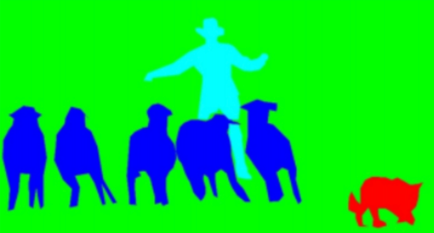

#### 图像分割方法？

普通：

- 阈值分割
- 区域分割
- 边缘分割
- 基于图论的分割：GrabCut算法 [OpenCV GrabCut图像分割算法的使用及其原理](https://blog.csdn.net/qq_38973721/article/details/105894488)

深度学习：

- 语义分割：在普通分割基础上，还要预测出物体的类别
- 实例分割：在语义分割基础上，还要区分出同一类不同的个体

#### 阈值分割基本原理？特点？主要方法？

**基本原理**：通过设定不同的特征阈值，把图像象素点分为若干类

**特点**：计算简单、运算效率较高、速度快

**主要方法**：

- 全局阈值法
- 自适应阈值法
- 最佳阈值法

#### 阈值分割的图像二值化是什么？

若分割后的图像取值为 $\{0,1\}$，$T$ 为阈值
$$
g(x,y) = \left\{ \begin{gathered}
  1\;\;\;\;f(x,y) \geqslant T \hfill \\
  0\;\;\;f(x,y) < T \hfill \\ 
\end{gathered}  \right.
$$

#### 阈值分割常用特征？

原始图像的灰度、彩色特征、或它们变换后的特征

#### 区域分割基本原理？主要方法？

**基本原理**：图像按照相似性准则分成不同的区域

**主要方法**：

- 区域生长法：从某个像素出发，按照一定的准则，逐步加入邻近像素，当满足一定的条件时，区域生长终止

  分割的好坏取决于：1、初始点的选取  2、生长准则  3、终止条件

- 区域分裂聚合法：先确定一个分裂聚合准则（区域特征一致性准则），当图像中某个区域的特征不一致时就将该区域分裂成4个相等的子区域，当相邻的子区域满足一致性特征时将它们聚合一个大区域，直至所有区域不再满足分裂聚合的条件为止
- 分水岭法：一种基于拓扑理论的形态学分割方法，把图像看作是测地学上的拓扑地貌，每个像素的灰度值表示该点的海拔高度，每个局部极小值及其影响区域称为集水盆，集水盆的边界形成分水岭。分水岭计算的两个步骤：1、灰度级从低到高排序  2、淹没：对每个局部极小值在h阶高度的影响域内采用先进先出结构进行判断和标注

#### 边缘分割基本原理？步骤？

**基本原理**：利用边缘检测算子提取边缘特征，然后进行分割

**步骤**：

- 滤波：去除图像的噪声，注意大多数滤波器在降噪的同时也会导致边缘强度的损失，因此需要折衷
- 增强：将邻域或局部灰度值有显著变化的点突显出来，一般通过计算梯度幅值来完成
- 检测：梯度幅值较大的点并不都是边缘，所以应该确定哪些点是边缘点
- 定位：确定边缘的位置和方向

#### 图像分割的评价指标？

- **像素精度 PA**：就是混淆矩阵的准确率

$$
PA = \frac{{TP + TN}}{{TP + FN + FP + TN}}
$$

- **交并比 IoU**：就是精确率和召回率的并除以二者的交

$$
IoU = \frac{{TP}}{{TP + FN + FP}}
$$

#### Mask R-CNN 是什么？

Mask R-CNN 是在 Faster R-CNN 基础上添加mask分支，同时提出 ROI-Align 来消除 ROI-Pooling 的量化误差，并添加特征金字塔网络结构 FPN 提升效果

# 特征检测

#### 特征检测前一般都需要进行高斯平滑，作用？

去除图像中的噪声

#### HOG 是什么？主要思想？

方向梯度直方图特征（Histogram of Oriented Gridients）

**主要思想**：在边缘具体位置未知的情况下，边缘方向的分布也可以很好的表示目标的外形轮廓

#### HOG 特征检测的主要步骤？

- **颜色空间归一化**

  对于彩色图像，需要进行图像灰度化

$$
I(x,y) = 0.3R(x,y) + 0.59G(x,y) + 0.11B(x,y)
$$

​		如果图像的光照不均匀，还需要进行伽马校正（幂律变换），常取 $\gamma=0.5$
$$
I(x,y) = I{(x,y)^\gamma }
$$

- **计算梯度幅值 $g$ 和梯度方向 $\theta$**

  需要在水平和垂直两个方向上分别用如下模板计算，然后求得

$$
\begin{gathered}
  {g_x} = I(x + 1,y) - I(x - 1,y) \hfill \\
  {g_y} = I(x,y + 1) - I(x,y - 1) \hfill \\
  g = \sqrt {g_x^2 + g_y^2} \;\;\;\;\;\;\theta  = \arctan \frac{{{g_y}}}{{{g_x}}} \hfill \\ 
\end{gathered}
$$

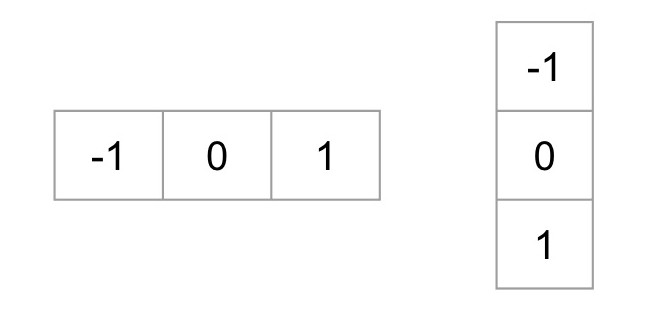

​		可以看到 $g_x$ 主要凸显垂直方向的线条， $g_y$ 主要凸显水平方向的线条，$g$ 结合了二者，凸显了像素值剧烈变化的地方

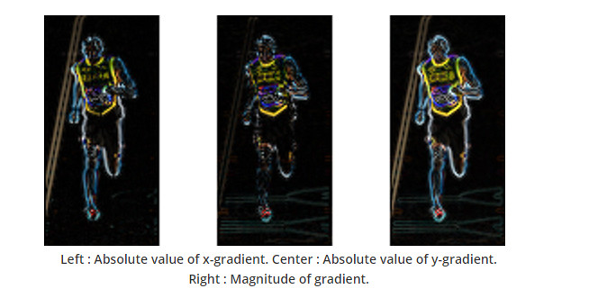

- **将图像划成多个小单元格（cell），分别计算每个 cell 的方向梯度直方图**

  每个 cell 的尺寸设为 $k\times k$，对于一个 $h\times w$ 的图像（假设可被 $k$ 整除），可得到 $hw/k^2$ 个 cell

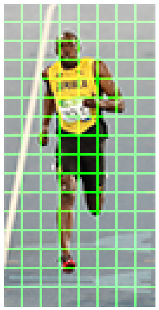

​		方向梯度直方图是一个9维向量，代表9个bin，角度分别为 0，20，40，...，160，这里用的无符号梯度（认为角度加180度方向不变），把梯度幅值把比例拆		分到对应两个bin里面

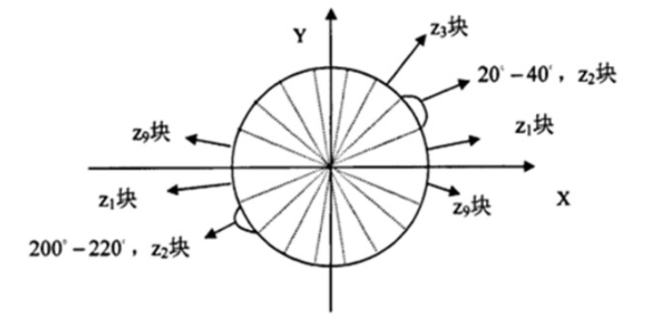

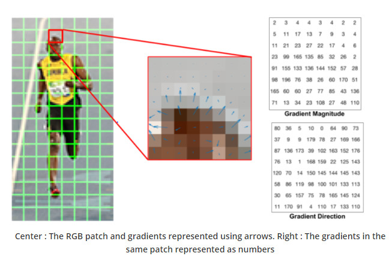

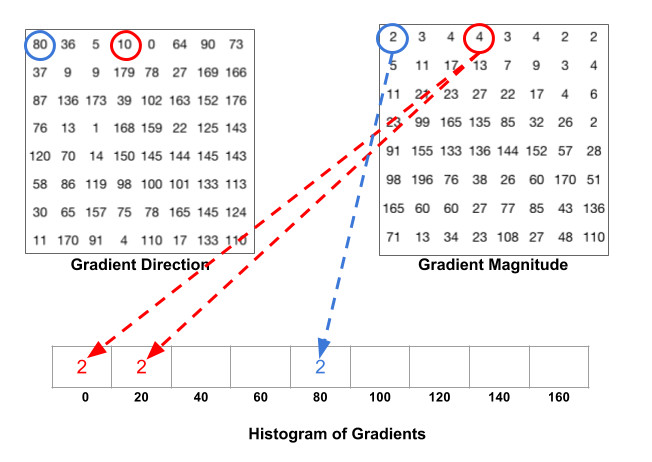

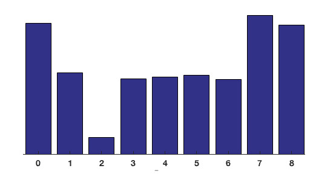

​		最终每个 cell 得到一个9维向量 $v = [{v_1},{v_2}, \cdots ,{v_9}]$

- **把 cell 组合成块（block），块内归一化梯度直方图**

  可以在高，宽方向上都取 $p$ 个 cell 组成一个 block，那么每个 block 包含 $p\times p$ 个 cell，将每个 block 里 cell 的直方图向量串联起来并进行L2范数归一化，可得一个 $9p^2$ 维的直方图向量

  如果沿着高宽方向的滑动步长都为1，那么一共可得 $(h/k - p + 1)(w/k - p + 1)$ 个 block

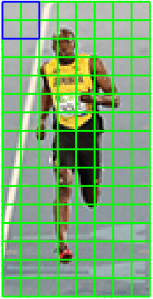

- **计算HOG特征向量**

  将所有 block 的直方图向量进行串联，即得到该幅图像的HOG特征向量

  对于 $h\times w$ 的图像，HOG特征维度为 $9(h/k - p + 1)(w/k - p + 1)p^2$ 

#### 可视化 HOG 特征？

HOG特征描述子捕捉了这个人的外形，特别是躯干和腿

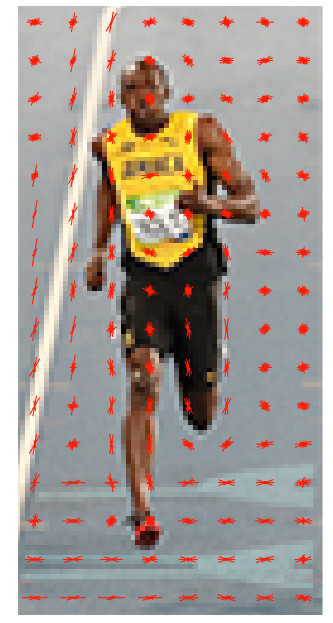

#### HOG 特征怎么用？

提取图像的HOG特征后，可以利用机器学习的分类算法（如SVM），以HOG特征向量为输入，训练模型，即可实现检测图像中是否包含目标

#### HOG 的特点？

- 对图像几何和光学的形变都能保持很好的不变性
- 行人肢体细微改变不影响检测效果，特别适合做图像中的人体检测

#### 图像的角点是什么？

有两种定义：

- 两个边缘的交点
- 邻域内具有两个主方向的特征点

#### 角点检测主要思想？

使用一个滑窗，若在任意方向上移动，窗口内的灰度值都有剧烈变化，则窗口中心就是角点

#### 角点检测一般步骤？

- 使用角点检测算子，计算每个像素的角点响应值
- 阈值化角点响应值，选择合适的阈值进行处理
- 对阈值化的角点响应值进行非极大值抑制，获取角点

#### 非极大值抑制 NMS 原理？

在一个窗口内，如果有多个角点，选择值最大的那个角点，删除其他角点

好处：可以去除某些黏在一起的角点，防止角点太密集，出现一小撮全是角点的情况（排除不稳定的角点）

#### 图像的积分图是什么？

积分图 $(x,y)$ 位置的值等于图像在该位置及左上角所有像素之和
$$
II(x,y) = \sum\limits_{x' \leqslant x,y' \leqslant y} {I(x',y')}
$$
好处：便于快速计算某个窗口的像素和（类似动态规划）

#### Harris 特征检测主要步骤？

用于角点检测，详见 [Harris角点检测](https://blog.csdn.net/qq_42518956/article/details/107491187)

- 计算在X，Y两个方向的梯度 $g_x$，$g_y$，和它们的乘积 $g_x^2$，$g_y^2$，$g_x g_y$

- 生成高斯窗口（对应窗口里面权值 $\omega(x,y)$），确定 $M$ 矩阵

$$
M = \sum\limits_{x,y} {\omega (x,y)\left[ {\begin{array}{*{20}{c}}
  {g_x^2}&{{g_x}{g_y}} \\ 
  {{g_x}{g_y}}&{g_y^2} 
\end{array}} \right]}
$$

- 根据 $M$ 计算每个像素的角点响应值 $R$（$\alpha$ 为参数），并设置一个阈值，小于阈值的 $R$ 清零

$$
R = \det M - \alpha {({\text{trace}}\;M)^2}
$$

- 在 3×3 或 5×5 的邻域内对 $R$ 矩阵进行非极大值抑制，极大值值点即为图像中的角点

#### Harris 的特点？

- **对亮度和对比度的变化不敏感（光照不敏感）**

Harris 特征计算过程中使用了梯度算子，梯度算子不改变角点响应值的极值点出现位置（最多只是影响角点检测数量而已），因此对图像亮度和对比度变化不敏感

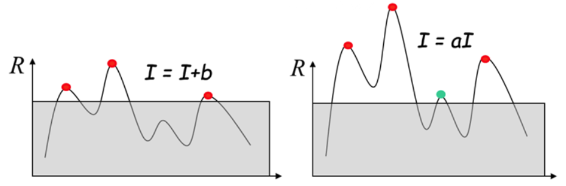

- **具有旋转不变性**

Harris 特征使用了角点附近区域灰度的二阶矩矩阵，可以表示成一个椭圆，椭圆的长短轴是二阶矩矩阵特征值平方根的倒数，当特征椭圆转动时，特征值并不发生变化，所以角点响应值也不发生变化，因此具有旋转不变性

- **不具有尺度不变性**

当对图像进行尺度变换时，在检测窗口尺寸不变的前提下，窗口内所包含图像的内容是完全不同的，检测结果也可能不同

例如，左侧的图像可能被检测为边缘或曲线，而右侧的图像则可能被检测为一个角点

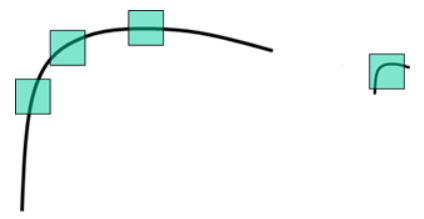

#### Harris 的参数 $\alpha$ 意义？

控制角点检测的灵敏性（检测数目）

- 增大 $α$ 值，将减小角点响应值，降低角点检测的灵敏性，减少被检测角点的数量

- 减小 $α$ 值，将增大角点响应值，增加角点检测的灵敏性，增加被检测角点的数量

#### SIFT 是什么？主要思想？

尺度不变特征转换（ Scale Invariant Feature Transform）

**主要思想**：基于图像中的一些局部兴趣点，而与图像的大小和旋转无关

#### SIFT 特征的主要步骤？

- 构建尺度空间，检测极值点，获得尺度不变性
- 特征点过滤并精确定位
- 为特征点分配方向值
- 生成特征描述子（SIFT 特征向量）
- 将原图和目标图的 SIFT 特征向量进行匹配

#### SIFT 的特点？

优点

- **不变性**：是图像的局部特征，对旋转、尺度缩放、亮度变化保持不变性，对视角变化、仿射变换、噪声也保持一定程度的稳定性
- **区分性**：信息量丰富，适用于在海量特征数据库中进行快速准确的匹配
- **多量性**：即使少数的几个物体也能产生大量的 SIFT 特征向量
- **高速性**：经优化的 SIFT 算法甚至可以达到实时要求
- **可扩展性**：方便与其他形式的特征向量联合

缺点

- 计算较复杂，实时性不高
- 对边缘光滑的目标特征点提取能力较弱

#### SIFT 为什么使用高斯卷积核？

高斯卷积核是实现尺度变换的唯一变换核

#### 为什么 SIFT 具有尺度不变性？

因为 SIFT 特征计算过程中构造了图像的高斯差分（DoG）金字塔

#### 为什么 SIFT 具有旋转不变性？

因为 SIFT 计算描述子的主方向，并在特征匹配时对匹配点的主方向检查

#### SURF 是什么？

加速鲁棒特征（Speeded Up Robust Feature）

SIFT 算法的重要改进版，解决了 SIFT 计算复杂度高、耗时长的缺点

#### SURF 特征提取步骤？

- 构建 Hessian 矩阵，生成所有的兴趣点，用于特征的提取
- 构建尺度空间
- 特征点定位
- 特征点主方向分配
- 生成特征描述子
- 特征点匹配

#### SURF 构建 Hessian 矩阵的原因？

生成图像稳定的边缘点

Hessian 矩阵是指多元函数的二阶偏导数构成的方阵，描述了函数的局部曲率

#### SURF vs SIFT？

|      差别      |          SIFT           |                   SURF                   |
| :------------: | :---------------------: | :--------------------------------------: |
| 金字塔图像形式 | 采用高斯差分（DoG）图像 |    采用 Hessian 矩阵行列式近似值图像     |
| 特征点的主方向 |   统计梯度直方图得到    | 圆形邻域的 harr 小波特征值最大的扇形方向 |
|    特征匹配    |        欧氏距离         |    欧氏距离 + Hessian 矩阵迹正负判断     |

#### SURF 为什么比 SIFT 快？

- 使用了积分图技术
- 使用了 Hessian 矩阵，减少了降采样过程
- 特征向量维数比较少，匹配速度快

#### BRIEF 主要思想？特点？

**主要思想**：抛弃传统梯度描述法，改用检测随机响应，并采用二进制编码方式，在特征点邻域提取描述子

**特点**：描述子更简单，存储空间比 SIFT、SURF 小很多，采用汉明距离进行特征匹配，速度更快。缺点是旋转不变性较差

注意：使用 BRIEF 的前提是已经通过其他方法得到特征点

#### BRIEF 特征检测的主要步骤？

- 图像滤波：用于去噪

- 选取点对：以特征点为中心，在邻域窗口中随机选取 $N$ 组点对

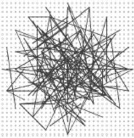

- 构建0-1特征描述符：$a$，$b$ 表示图像中点对的两个端点，$N$ 个点对的描述符串联即构成 BRIEF 特征

$$
t(a,b) = \left\{ {\begin{array}{*{20}{c}}
  {1\;\;\;\;I(a) > I(b)} \\ 
  {0\;\;\;\;I(a) \leq I(b)} 
\end{array}} \right.
$$

#### BRIEF 为什么使用的是汉明距离？

因为采用了二进制编码

#### ORB 是什么？

ORiented BRIEF

可以看作 BRIEF 和 FAST 的组合，速度极快

#### ORB 特征检测的主要步骤？

- 使用 FAST 提取特征点
- 使用 BRIEF 计算特征点的描述子

#### FAST 是什么？

加速分割测试特征（Features from Accelerated Segment Test）

#### FAST 特征提取的主要步骤？

- 在图像中任选一点 $p$， 假定其像素(亮度)值为 $I_p$
- 以3为半径画圆，覆盖 $p$ 点周围的16个像素
- 设定阈值 $T$，如果周围16个像素中有连续 $n$ 个与 $I_p$ 之差绝对值大于 $T$， 那么这个点就被判断为角点

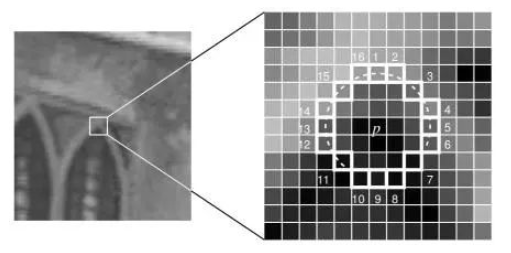

#### MSER 是什么？

最大稳定极值区域（Maximally Stable Extremal Regions）

常被用于提取图像中的斑点，是一种分水岭算法，通过阈值分割，不断提升分割阈值，连通域变化稳定的区域被称为最大稳定极值区域

#### MSER 的特点？

- 仿射变换不变性
- 稳定性，具有相同阈值范围所支持的区域才会被选择
- 无需任何平滑处理就可以实现多尺度检测，即小的和大的结构都可以被检测到

#### LBP 是什么？

局部二值模式（Local Binary Pattern）

一种用来描述图像局部纹理特征的算子，用于局部纹理特征提取

#### LBP 的主要步骤？

在$3\times 3$ 窗口内，以中心像素为阈值，将相邻的8个像素的灰度值与其比较，大于中心像素的置1，否则为0，每个中心像素可得到一个8位二进制编码（LBP码），用于反映该区域的纹理信息

#### LBP 的特点？

- 具有灰度不变性
- 不具备旋转不变性

#### Harr（Haar-like）是什么？主要步骤？

一种特征描述算子

主要步骤：用Harr特征模板黑色部分的所有像素值和减去白色部分所有像素值和，得到一个特征值

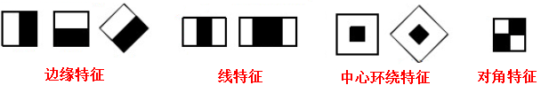

# 目标检测

#### 目标检测含义？

获悉目标是什么并定位目标位置

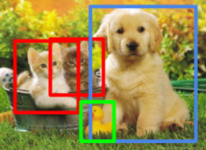

#### 目标检测应用？

- 人脸检测
- 行人检测
- 车辆检测
- 遥感监测

#### 目标检测常用数据集？

- **PASCAL VOL 数据集（PASCAL Visual Object Classes）**

用于目标检测

共有两个版本：VOC 2007 和 VOC 2012，含有20个类别

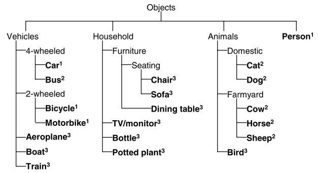

数据集量（红色部分为估计值，官方未给出）：

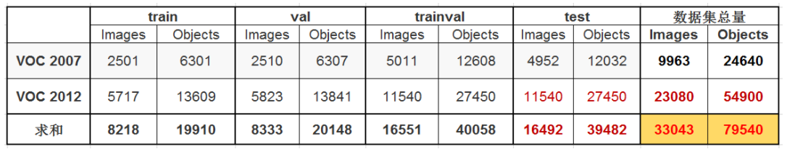

学术界常见用法：

|                          训练                           |     测试      |
| :-----------------------------------------------------: | :-----------: |
|         VOC 2007 trainval 和 VOC 2012 trainval          | VOC 2007 test |
| VOC 2007 trainval 和 VOC 2007 test 和 VOC 2012 trainval | VOC 2012 test |

- **MS COCO 数据集（Microsoft Common Objects in Context）**

用于目标检测，图像识别，图像分割

共有三个版本：COCO 2014，COCO 2015 和 COCO 2017，含有80个类别

数据集量：

|               | train | val  | test |
| :-----------: | :---: | :--: | :--: |
| **COCO 2014** |  83k  | 41k  | 41k  |
| **COCO 2015** |   -   |  -   | 81k  |
| **COCO 2017** | 118k  |  5k  | 41k  |

学术界常见用法：

|                           训练                           |        测试        |
| :------------------------------------------------------: | :----------------: |
| trainval35k：COCO 2014 train 和 COCO 2014 val（35k子集） | minival：剩余的val |

- **Google Open Image 数据集**

最新发布的 Open Images V4 包含190万图像，600个类别，1540万个 bounding-box 标注，是当前最大的带物体位置标注信息的数据集

- **ImageNet 数据集**

目前世界上图像识别最大的数据库，应用非常广，几乎成为深度学习图像领域算法性能检验的“标准”数据集，有1400多万幅图片，2万多个类别，其中有超过百万的图片有明确的类别标注和物体位置标注

- **DOTA 数据集**

遥感航空图像检测的常用数据集，包含2806张航空图像，尺寸大约为 4kx4k，15个类别，共计188282个实例

航空图像的特点：尺度变化性更大，小物体密集，目标具有不确定性

#### 目标检测常用评价指标？

- **平均精度均值 mAP（mean Average Precision）**：多个类别 AP 的平均值

- **交并比 IoU**：预测框与真实框的交集除以并集，衡量重合程度，一般认为大于0.5即可接受

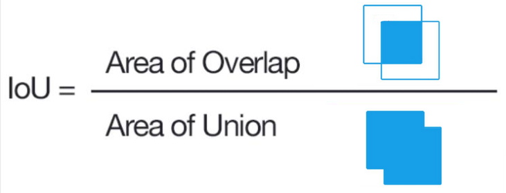

- **准确率，精确率，召回率，F1，ROC，AOC等**

- **帧每秒 FPS（Frames Per Second）**：每秒能够处理多少张图像，衡量检测速度

#### 目标检测中的非极大值抑制 NMS 原理？

本质是搜索局部极大值，抑制非极大值元素

多个预测 bounding box 结果，去掉与 Ground Truth 交并比非最大的，保留最大的作为预测结果

#### 目标检测流程？输出是什么？

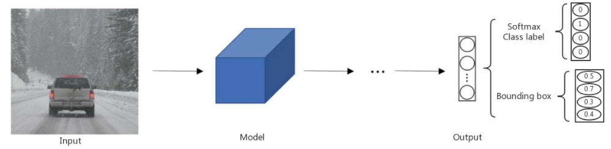

输出向量：
$$
\hat{y}=[b_x,b_y,b_h,b_w,c_1,c_2,\cdots]^{\rm T} \quad \text{or} \quad [p_c,b_x,b_y,b_h,b_w,c_1,c_2,\cdots]^{\rm T}
$$
其中 $p_c$ 表示图中有物体的概率，$b_x,b_y,b_h,b_w$ 表示预测的边框（Bounding Box）中心坐标和高宽，$c_1,c_2,\cdots$ 表示类别

#### 候选区域（Region Proposal）是什么？产生方法？

Region Proposal 是一组可能包含目标的边框

产生方法：

- **滑动窗口法**：采用不同大小的滑窗从左到右、从上到下在图像上滑动，每次滑动时使用预训练好的分类器对当前窗口的图像进行分类，如果输出分类概率较大，则认为检测到了物体，对于检测到物体的多个窗口，采用非极大值抑制NMS，选择概率最大的窗口作为 Region Proposal

  缺点是效率低下，不适合实时性要求较高的算法

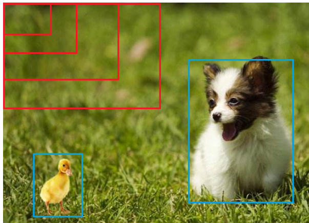

- **选择搜索法**（Selective Search）：分割输入图像产生多个小的子区域，根据子区域间的相似性（颜色、纹理、大小等）不断进行区域合并，最终得到 Region Proposal

  优点是效率高，结果可以包含各种大小的框

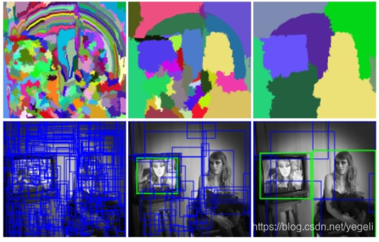

#### 边框回归（Bounding Box Regression）是什么？

对侯选区域（Region Proposal）进行纠正的线性回归算法，目的是为了让 Region Proposal 提取到的窗口与目标窗口（Ground Truth）更加吻合

#### 目标检测算法的 Two Stage 和 One Stage 区别？

目标检测算法分为 Two Stage 和 One Stage 两类

- **Two Stage**：先生成 Region Proposal，再通过CNN进行目标分类/定位回归

  常见算法：R-CNN系列（R-CNN、Fast R-CNN、Faster R-CNN）、SPP-Net、R-FCN 等

- **One Stage**：不用 Region Proposal，直接在网络中提取特征来进行目标分类/定位回归

  常见算法：YOLO系列（YOLOv1-v5）、SSD、RetinaNet 等

#### **目标检测为什么在小目标上效果不好？**

小目标对应的anchor会很少，而在检测目标时，需要足够大的feature map来提供精确特征，同时也需要足够的语义信息来区分目标和背景

#### R-CNN 是什么？

全称 Regions with CNN features

《Rich feature hierarchies for accurate oject detection and semantic segmentation》--2014

**用途**：目标检测、语义分割

**网络结构**：

- 特征提取：AlexNet
- 目标分类：SVM
- 边框回归：线性回归模型

**采用数据集**：PASCAL VOC

**步骤**：

- 在 Image Net 数据集上预训练 AlexNet
- 使用选择搜索法（Selective Search）生成侯选区域框（Region Proposal，每幅图片约2000个）
- 调整（resize/warp）Region Proposal 成固定大小，再在 PASCAL VOC 数据集上重新训练，对网络最后的全连接层权重进行微调（fine-tune)
- 利用提取的 CNN feature，训练一系列 SVM 来预测类别（每类对应一个 SVM）
- 进行边框回归（Bounding Box Regression），训练线性回归模型对边框的位置尺寸进行校正

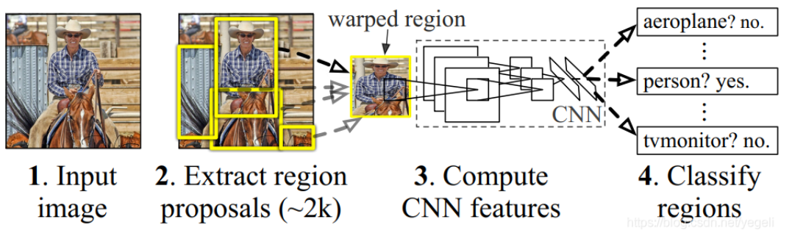

**效果**：

在 VOC 2007 测试集上mAP达到58.5%，打败当时所有的目标检测算法

**缺点**：

- 效率不高：选择搜索法生成 Region Proposal，每帧图像需2秒
- 重复计算：每个 Region Proposal 都需要经过 AlexNet 提取特征，为所有的感兴趣区域 RoI（Region of Interest）提取特征大约花费47秒
- 非端到端：三个模块（提取、分类、回归）是分别训练的，存储空间消耗较大
  

#### Fast R-CNN 是什么？

R-CNN 的改进版

《Fast R-CNN》 --2015

**用途**：目标检测

**网络结构**：VGG16

**采用数据集**：PASCAL VOC

**步骤**：

- 在 Image Net 数据集上预训练 VGG16
- 使用选择搜索法（Selective Search）生成侯选区域框（Region Proposal，每幅图片约2000个）
- 将 Region Proposal 和 VGG16 的 conv5 提取的 CNN feature 送入 RoI Pooling 层，统一到相同的尺度
- 继续经过共享全连接层得到特征，再分别送入两个不同的全连接层，一个计算目标Softmax分类损失（负对数损失），一个计算边框回归损失（平滑L1损失）

**效果**：

训练速度是 R-CNN 的10倍，预测速度是 R-CNN 的150倍

mAP指标与 R-CNN 相差不大

**缺点**：

- 依旧使用选择搜索法生成 Region Proposal，每帧图像需2秒，比较耗时
- 没有真正实现端到端，无法满足实时性检测要求

#### Fast R-CNN 用的 RoI Pooling 是什么？

一种最大池化层，作用是将大小不一的每个候选区域 Region Proposal 均匀分成 $M\times N$ 块，对每块进行最大池化，转变为大小统一的数据

因为全连接层的输入要求尺寸大小一样，因此不能直接把 Region Proposal 作为输入

#### Fast R-CNN 损失函数是什么？

多任务损失函数（Multi-task loss）：由两部分相加组成，一部分是分类损失 $L_{cls}$（采用负对数损失），一部分是边框回归损失 $L_{reg}$（采用平滑L1损失）
$$
\begin{gathered}
  L = {L_{cls}} + \lambda {L_{reg}} \hfill \\
  {L_{cls}} =  - p\log p^{*}-(1-p)\log (1-p^{*})\;\;\;\;\; \hfill \\
  {L_{reg}} = \sum\limits_{i = 1}^4 {g({t_i} - {t_i^{*}})\;\;\;\;\;\;\;\;g(x) = \left\{ \begin{gathered}
  0.5{x^2}\;\;\;\;\;\;\left| x \right|{\text{ < 1}} \hfill \\
  \left| x \right| - 0.5\;\;\;\;otherwise \hfill \\ 
\end{gathered}  \right.}  \hfill \\ 
\end{gathered}
$$

#### Fast R-CNN vs R-CNN 改进地方（为什么比R-CNN快）？

- 卷积不再是对每个 Region Proposal 进行，而是直接对整张图像，减少了重复计算
- 用 RoI Pooling 进行特征的尺寸变换
- 将分类和回归放进网络一起训练，用 FC + Softmax 代替 SVM，用 FC 代替线性回归
- 用SVD分解加速全连接层（前三个因素是核心）

#### Faster R-CNN 是什么？

Fast R-CNN 的改进版

《Faster R-CNN: Towards Real-Time Object Detection with Region Proposal Networks》 --2016

**用途**：目标检测

**网络结构**：VGG19

**采用数据集**：PASCAL VOC

**步骤**：

- 用一组基础的卷积层（如VGG19）提取图像的 feature maps
- 使用区域生成网络 RPN（Region Proposal Networks）生成 Region Proposal
- 将 feature map 和 Region Proposal 送入 RoI Pooling 层，统一到相同的尺度
- 继续经过共享全连接层得到特征，再分别送入两个不同的全连接层，一个计算目标Softmax分类损失（负对数损失），一个计算边框回归损失（平滑L1损失）

**效果**：

- 在 VOC 2007 测试集上mAP达到73.2%，目标检测速度可达5帧每秒
- RPN 网络取代选择搜索法，生成 Region Proposal 时间从2秒缩减到了10毫秒
- 真正实现端到端

**缺点**：

仍无法达到实时性检测要求

#### Faster R-CNN 用的 RPN 是什么？

区域生成网络（Region Proposal Networks），用于输出 Region Proposal

网络结构：

一些 $3\times 3$ 的卷积层 ---> 两个 $1\times 1$ 的卷积层，一个经过Softmax激活用于输出 $2k$ 个目标 score（是目标或不是目标，IoU阈值设为0.7），一个输出 $4k$ 个锚点框 anchor 的参数（中心坐标 $x$，$y$，偏移量 $\delta x$，$\delta y$），其中 $k$ 为 anchor 个数

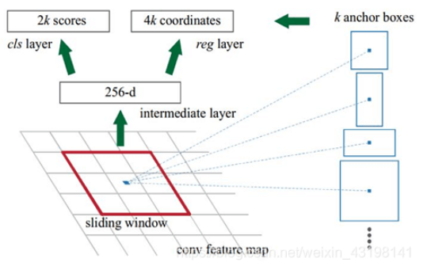

#### RPN 中的 anchor 是什么？

一组在图像上预设好不同大小，不同长宽比的参照框

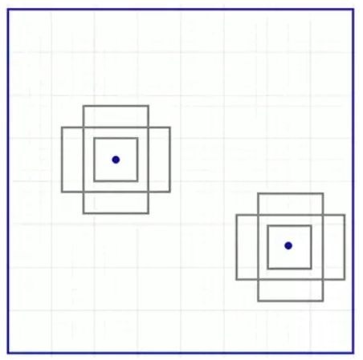

Faster R-CNN 中 RPN 使用的 anchor 有三个尺度{128, 256, 512}，三个比例{1:1, 1:2, 2:1}，共9组 anchor

#### Faster R-CNN 的损失函数？

多任务损失，和 Fast R-CNN 一样

#### Faster R-CNN vs Fast R-CNN 改进的地方（为什么比Fast R-CNN快）？

使用一个 RPN 网络生成 Region Proposal，比 Fast R-CNN 使用的选择搜索法更高效

#### YOLO 是什么？

全称 You Only Look Once，有5个版本v1-v5

属于 One stage 检测算法，将目标检测作为回归问题求解，直接在输出层回归 bounding box 的位置及其所属类别，没有显示求取 Region Proposal 的过程

**用途**：目标检测

**网络结构**：DarkNet

- **YOLOv1**

24个卷积层，后面2个全连接层

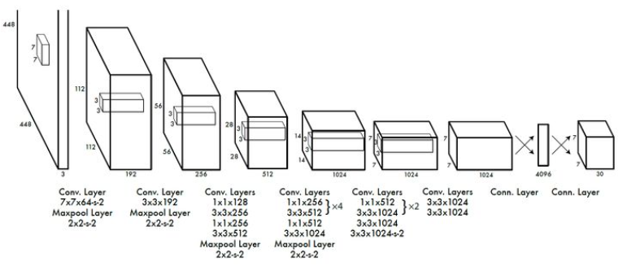

实现方法：

- 将图像分成 $S\times S$ 个 网格（grid cell），如果某个目标的中心落在 grid cell 中，则由这个 grid cell 负责预测该目标

- 每个 grid cell 负责预测 $B$  个 bounding box，每个 bounding box 除了要回归自身的位置和大小外，还需要预测一个 confidence（代表所预测的box中含有目标的置信度和这个box预测的有多准 $confidence = Pr(object)\times IoU_{\rm pred}^{\rm truth}$）

优点：速度快，能很好利用图像的context信息，可以学到物体的泛化特征

缺点：mAP不高，召回率低，容易定位错误，对小物体检测效果不好

- **YOLOv2**

改进：

- 使用了带anchor box的卷积层（最主要），召回率提升较大，mAP有所下降
- 去掉Dropout，使用BN
- 分类器可以处理更高分辨率图像（High Resolution Classifier）
- 采用K-means对边界框做聚类分析，比手动选择的IoU值更大，模型更容易学习
- 采用DarkNet-19，计算量减小
- 使用细粒度特征和多尺度训练

- **YOLOv3**

改进：

- 采用新的网络 DarkNet-53（引入了残差块，网络加深）
- 用逻辑回归替代Softmax作为分类器
- 融合特征金字塔网络 FPN（Feature Pyramid Networks），实现多尺度检测

#### YOLO 损失函数？

三部分组成：坐标损失 + IoU损失 + 分类损失

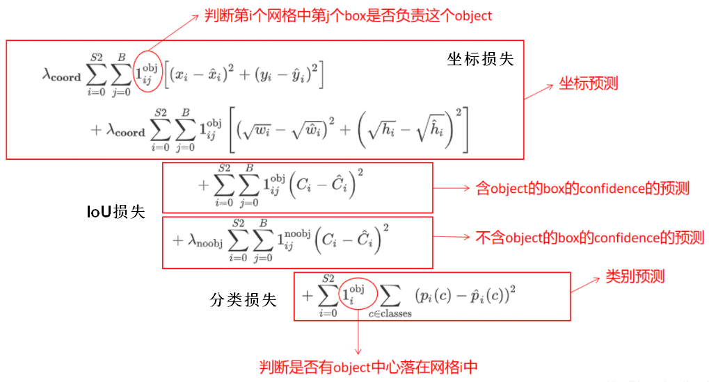

#### SSD 是什么？

全称 Single Shot MultiBox Detector，2016年提出，相比 Faster R-CNN 有明显的速度优势，相比 YOLO 有明显的mAP优势

**用途**：目标检测

**特点**：

- 从YOLO中继承了将检测转化为回归的思路，一次完成目标定位与分类
- 基于Faster RCNN中的Anchor，提出了相似的Prior box
- 加入基于特征金字塔（Pyramidal Feature Hierarchy）的检测方式，即在不同感受野的feature map上预测目标

**网络结构**：

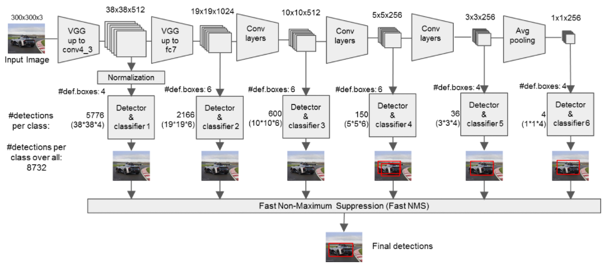

主要包含：

- VGG16 Base Layer
- Extra Feature Layer
- Detection Layer
- NMS

#### RetinaNet 是什么？

一种目标检测网络，本质上是由 Resnet + FPN + 两个FCN子网络组成，主要解决类别不平衡问题

《Focal Loss for Dense Object Detection》 --2018

目标检测的类别不平衡：在得到的一堆anchor中，实际上只有少量目标框，存在很多无用的背景图，导致极端的类别不平衡

#### RetinaNet 损失函数？

- 分类用Focal loss：平衡交叉熵损失的改进版，主要解决正负样本比例严重失衡的问题，该损失函数降低了大量简单负样本在训练中所占的权重

$$
{L_{focal}} =  - \alpha {(1 - p)^\gamma }\log p - (1 - \alpha ){p^\gamma }\log (1 - p)
$$

- 回归用平滑L1 loss

# OpenCV

#### OpenCV读取图像为什么是BGR格式，而不是RGB？

- OpenCV在1999年由Intel建立，当时主流的摄像头制造商和软件供应商提供的摄像头采集图像的通道排列顺序为BGR
- 位图BMP最简单，是Windows显示图片的基本格式，在Windows下，任何格式的图片文件（包括视频）都要转化为位图才能显示出来，而位图BMP采用的格式就是BGR，于是OpenCV开发者就选择BGR格式作为规范沿用至今

